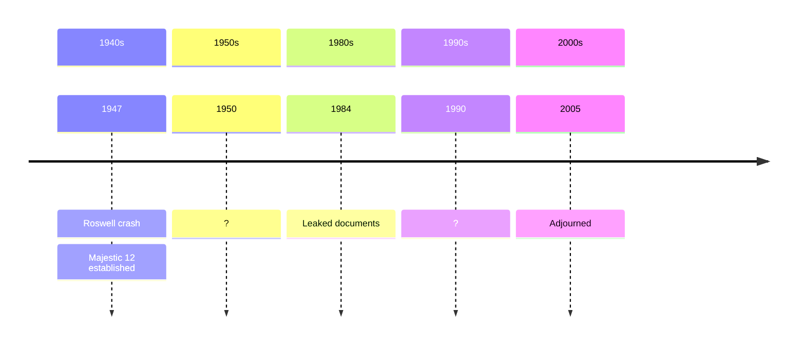

# Majestic Twelve

The Majestic Twelve (MJ-12) is a purported secret organisation that coordinates the UFO cover-up established in 1947.

C. Ronald Garner
> MJ-12 is a ULTRA TOP SECRET Research and Development, Intelligence
Operation established by President Truman on September 24, 1947. MJ-12
was a Committee set up inside the National Security Council (NSC). In 1954, President Eisenhower
signed the Secret Executive Order, “Order Number 54-12”

# Evidence

## Wilson-Davis notes

The Wilson-Davis memo seems to confirm the existence of MJ-12 or a similar control group.

This is a citation from Eric Davis' notes from their conversation, where TW is Admiral Tom Wilson and EWD is the author.

> **TW:** Confirmed Greer/Miller/Mitchell gave talk in Pentagon Conference room. Adm.
> Mike Crawford, Gen. Pat Hughes (Hughes his boss) were present (others. too.) Date
> April '97. (Ed Mitchell said 4/9/97.) After group broke up, Miller/Wilson talked
> (privately) 2 hours on UFOs, MJ-12, Roswell, crashed UFOs/alien bodies, etc. TW
> intrigued - knew about intelligence on US mil/intell UFO close encounters - and foreign
> gov't encounters. Seen records. Told Miller.
> 
> **TW:** Yes., Miller asked the question on MJ-12/UFO cabal-crashed UFO. Confirmed he
> called Miller ca. late June '97 and told that he/Miller was *right* - **there is such an
> organization in existence.**
>
> **EWD:** What did you tell?
>
> **TW:** I found it, where I looked, who I talked to but did not name every one - that's it.

## Shandera document

Timothy Good *Above Top Secret* page 257:
> According to a document acquired by TV producer Jaime Shandera in 1984, a highly secret panel, code-named “Majestic 12” or “MJ-12,” was formed by President Truman in 1947 to investigate UFOs and report
on its findings to the President. The document, dated 18 November 1952 and classified TOP SECRET/MAJIC/EYES ONLY, was allegedly pre-
pared for President-elect Dwight Eisenhower, and includes the astonishing statement that the remains of four alien bodies were recovered two miles
from the Roswell wreckage site

# Organisation structure

Panel of twelve members?

What is the relationship of MJ-12 to the CIA, USAF, etc?

## Committee of the Majority

What is this?

# Timeline

# Sources

- Ryan Woods [Majestic Documents](https://majesticdocuments.com/)
