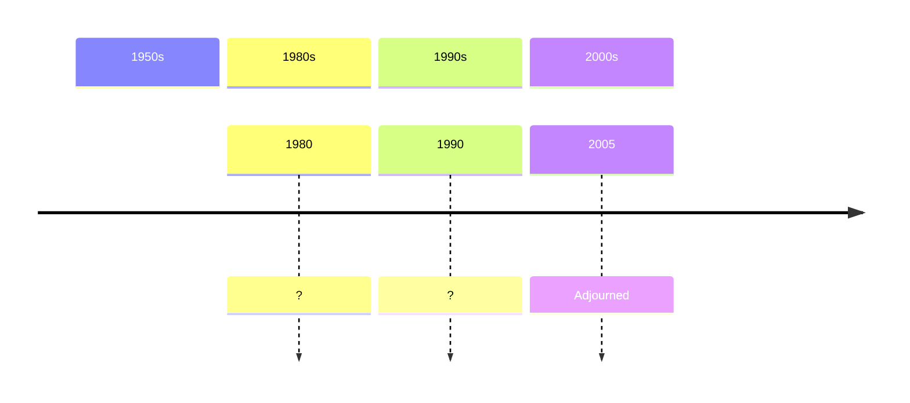

# Majestic Twelve

The Majestic Twelve (MJ-12) is a purported secret organisation that coordinates the UFO cover-up.

C. Ronald Garner
> MJ-12 is a ULTRA TOP SECRET Research and Development, Intelligence
Operation established by President Truman on September 24, 1947. MJ-12
was a Committee set up inside the NSC. In 1954, President Eisenhower
signed the Secret Executive Order, “Order Number 54-12” (NSC=National
Security Council)

# Wilson-Davis notes

The Wilson-Davis memo seems to confirm the existence of MJ-12 or a similar control group.

> TW: Confirmed Greer/Miller/Mitchell gave talk in Pentagon Conference room. Adm.
> Mike Crawford, Gen. Pat Hughes (Hughes his boss) were present (others. too.) Date
> April '97. (Ed Mitchell said 4/9/97.) After group broke up, Miller/Wilson talked
> (privately) 2 hours on UFOs, MJ-12, Roswell, crashed UFOs/alien bodies, etc. TW
> intrigued - knew about intelligence on US mil/intell UFO close encounters - and foreign
> gov't encounters. Seen records. Told Miller.
> TW: Yes., Miller asked the question on MJ-12/UFO cabal-crashed UFO. Confirmed he
> called Miller ca. late June '97 and told that he/Miller was *right* - **there is such an
> organization in existence.**

# Committee of the Majority

What is this?

# Timeline

# Sources

- 
