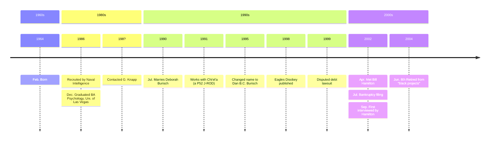

# Dan Burisch

Dr. Danny B. Catselas Burisch, formerly Dan B. Crain. Born 1964-02-02. Gifted child. Purported whistleblower from Area 51 and claims to be a member of Majestic-12.

# Media

- William F. Hamliton III
    * [Dr. Dan Burisch Biographical Info](https://web.archive.org/web/20021102115616/http://www.skywatch-research.org/BurischBio.htm)
    * [The Last Letter from Dr. Dan B.C. Burisch](https://web.archive.org/web/20021102115745/http://www.skywatch-research.org/message.htm)
    * [Photos of Dan Burisch](https://web.archive.org/web/20021208174141/http://www.skywatch-research.org/gallery.html)
- Linda Moulton Howe, *Earthfiles*
    * [Whistleblower Microbiologist Dan Burisch Interview](https://www.earthfiles.com/2004/05/19/part-1-whistleblower-microbiologist-dan-burisch-interview-on-june-7-2003/), June 2003
    * [Whistleblower Microbiologist Speaks Out About Alleged “Alien” Named J-Rod](https://www.earthfiles.com/2003/09/15/updated-part-1-whistleblower-microbiologist-speaks-out-about-alleged-alien-named-j-rod/), September 2003
    * [Field Trip with Microbiologist Dan Burisch to Frenchman Mountain, Nevada](https://www.earthfiles.com/2004/06/12/part-1-field-trip-with-microbiologist-dan-burisch-to-frenchman-mountain-nevada/), June 2004
- Open Minds Radio [Michael Schratt discusses Dan Burisch](https://www.youtube.com/watch?v=x_koB91A6O0)
- Jeremy Rys (Alien Scientist) [Dan Burisch (Dan Crain)](https://alienscientist.com/burisch.html)
- Book: C. Ronald Garner *Alien Disclosure at Area 51*
- Project Camelot [Dan Burisch Summary](https://projectcamelotportal.com/2008/01/04/dan-burisch-summary/)

# Education

## Undergraduate

Burisch claimed that he studied at university but didn't graduate normally.

> Sixty-one creditors are listed which include ten student loans in the years 1997 to 2000 and two years listed as 1977, totaling $14,248. It is not known if the “1977s” are typos. Danny B Crain was 13 years old in 1977. Bill Hamilton raises the question, “If these are student loans for Dan Burisch, what school/s has he attended and what subjects has he taken? [Howe](https://www.earthfiles.com/2004/07/13/the-chapter-7-bankruptcy-of-dan-and-deborah-burisch/)

## Postgraduate

[Howe](https://www.earthfiles.com/2004/07/13/the-chapter-7-bankruptcy-of-dan-and-deborah-burisch/)
> In 1986, Dan Burisch said he was approached by the U. S. Navy to work for them and that the government paid for him as Danny B Crain to go on with his Ph.D. work in Microbiology and Molecular Genetics at State University of New York (SUNY) ­ Stonybrook. According to Dan, no one can have access to his SUNY records because the Majestic-12 demands secrecy in the interest of classified projects and national security. Bill Hamilton says a man who did not want to speak on the record remembered Danny Crain in biology courses at SUNY. But television reporter, George Knapp, says he first received correspondence from Danny Crain back in the late 1980s about computer systems functioning through biological neuronal tissue, but has never been able to find a professor or anyone at SUNY that remembers a Ph.D. student named Danny Crain.

# Bankruptcy filing

Linda Moulton Howe, *Earthfiles* [The Chapter 7 Bankruptcy of Dan and Deborah Burisch](https://www.earthfiles.com/2004/07/13/the-chapter-7-bankruptcy-of-dan-and-deborah-burisch/), 2004

Moulton Howe
> Chapter 7 bankruptcy was signed on July 16, 2002, and received and filed with the United States Bankruptcy Court on July 19, 2002. This is a public record.

[Marcia McDowell](mcdowell_marcia.md) stated:
> Marcia McDowell said, “Dan has not worked for the U. S. government like people think of a government scientist. There are no paychecks involved, no 401-K’s and matching funds and retirement. There is nothing like that. He works for Majestic-12 (MJ).
> They take care of him. But they don’t micro-manage the messiness of lives. Chapter 7 and other bankruptcy options can be used as tools by MJ without leaving a paper trail that incriminates them.

# Stolen valour claims

Moulton Howe
> In April 2002, Dan Burisch told Bill he was a microbiologist who had worked for the U. S. government’s MJ-12 and MAJI Committee since recruitment in 1986 by Naval Intelligence while he was completing his Bachelor’s Degrees in Psychology at the University of Las Vegas in Nevada. There are no military records for Danny B Crain or Danny B Catselas Burisch and Dan explained he was never inducted in any military unit. But in his secret work as a government microbiologist, he said he would sometimes be asked to wear military uniforms for formal meetings.

According to [Jeremy Rys](https://alienscientist.com/burisch.html):

> Vietnam Veteran and actual former Area 51 Employee Edgar Fouche worked with a few ex Navy Seals to file "Stolen Valor" charges against Dan "Burisch" Crain, subsequently prompting Dan to remove nearly 80% of his videos and other online materials from the web to avoid being charged and court martialed. 

# Q-94-109A document

Purported leaked medical report of "in vitro experimentation, ...Extraterrestrial Biological Entity (EBE) A.K. 'AQ-J-Rod.'" as part of a secret project known as AQ-J-Rod.

# Eagles Disobey

*Eagles disobey: The case for Inca City, Mars* ISBN-13: 9780964809024

# Website

- [Eagles Disobey](https://web.archive.org/web/20040607235819/http://scorpius.spaceports.com/~bemused/eaglesdisobey/index.html) (2004 Internet Archive)

# Timeline

