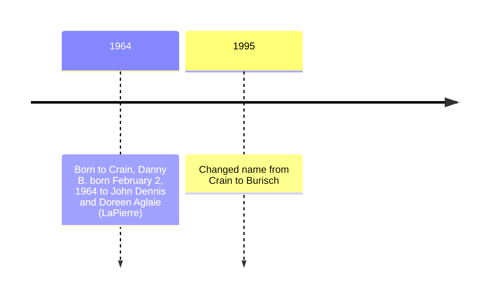

# Dan Burisch

Dr. Dan B. Burisch, formerly Dan B. Crain.

- William F. Hamliton III
    * [Dr. Dan Burisch Biographical Info](https://web.archive.org/web/20021102115616/http://www.skywatch-research.org/BurischBio.htm)
    * [The Last Letter from Dr. Dan B.C. Burisch](https://web.archive.org/web/20021102115745/http://www.skywatch-research.org/message.htm)
- Jeremy Rys (Alien Scientist) [Dan Burisch (Dan Crain)](https://alienscientist.com/burisch.html)

# Stolen valour claims

According to [Jeremy Rys](https://alienscientist.com/burisch.html):

> Vietnam Veteran and actual former Area 51 Employee Edgar Fouche worked with a few ex Navy Seals to file "Stolen Valor" charges against Dan "Burisch" Crain, subsequently prompting Dan to remove nearly 80% of his videos and other online materials from the web to avoid being charged and court martialed. 

# Eagles Disobey

*Eagles disobey: The case for Inca City, Mars* ISBN-13: 9780964809024

# Website

- [Eagles Disobey](https://web.archive.org/web/20040607235819/http://scorpius.spaceports.com/~bemused/eaglesdisobey/index.html) (2004 Internet Archive)

# Timeline

