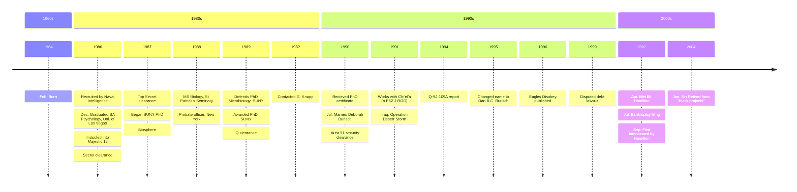
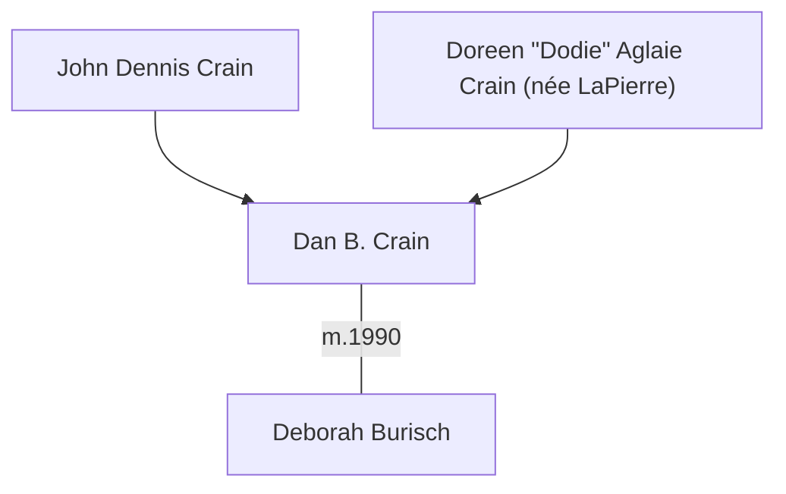

# Dan Burisch

> Why won't the aliens save us? We have to save ourselves. &mdash; Dan Burisch

Dr. Danny B. Catselas Burisch, formerly Danny B. Crain. [Born 1964-02-02](burisch_dan/burisch_birth_certificate.jpg). Purported whistleblower from Area 51 and claims to be a member of Majestic-12 (MJ-12.)

# Timeline

This timeline shows the key events in Burisch's life and career.

## Sources

These are sources for this timeline:

- [Eagles Disobey timeline](https://web.archive.org/web/20020811102135/http://www.eaglesdisobey.com/timeline2.htm)
- Linda Moulton Howe, *Earthfiles* [The Chapter 7 Bankruptcy of Dan and Deborah Burisch](https://www.earthfiles.com/2004/07/13/the-chapter-7-bankruptcy-of-dan-and-deborah-burisch/) 2004-07-13
- [Bill Hamilton](hamilton_william.md) [Dr. Dan Burisch timeline](https://web.archive.org/web/20030804013141/www.skywatch-research.org/ufo/Dans_timeline.htm)

# Family

## Name change

Dan Crain changed officially changed his name to Dan Burisch (see his [name change document](burisch_dan/burisch_crain_name_change.jpg), [page 2](burisch_dan/burisch_crain_name_change_2.jpg) 1995-06-03) to match that of his wife and daughter.

## Family tree

# Majestic Twelve

He claims to have held the position of "MJ-9" (i.e. the 9th of twelve roles) in [Majestic Twelve](../organisations/mj12.md).

According to [Marcia McDowell](https://projectcamelotportal.com/2008/01/04/dan-burisch-summary/):

> Dr. Burisch was a Senior Operative/Scientist, responsible first to the Committee of the Majority and the Majestic 12 (1986-2003),
> then only to the Majestic 12 (2003-2005), before it was adjourned (October 12, 2005).

Why would a scientific worker be appointed to this high position that was formerly held by senior scientists, generals, and politicians?

> Dr. Burisch sat as a pro-tem member of the Majestic 12, as MJ-9, and was finally assigned as H-1-Maj,
> the designated person to disclose the “extraterrestrial human lineage (time travel) information”.
> He completed his final orders in September, 2006, and is retired from service.

Why did they first punish him for speaking out, and then order him to disclose?

What he did do to fulfill these orders in September 2006?

# Media

- William F. Hamliton III
    * [Dr. Dan Burisch Biographical Info](https://web.archive.org/web/20021102115616/http://www.skywatch-research.org/BurischBio.htm)
    * [The Last Letter from Dr. Dan B.C. Burisch](https://web.archive.org/web/20021102115745/http://www.skywatch-research.org/message.htm)
    * [Photos of Dan Burisch](https://web.archive.org/web/20021208174141/http://www.skywatch-research.org/gallery.html)
- Linda Moulton Howe, *Earthfiles* [#dan-burisch](https://www.earthfiles.com/tag/dan-burisch/)
    * [Whistleblower Microbiologist Dan Burisch Interview](https://www.earthfiles.com/2004/05/19/part-1-whistleblower-microbiologist-dan-burisch-interview-on-june-7-2003/), June 2003
    * [Whistleblower Microbiologist Speaks Out About Alleged “Alien” Named J-Rod](https://www.earthfiles.com/2003/09/15/updated-part-1-whistleblower-microbiologist-speaks-out-about-alleged-alien-named-j-rod/), September 2003
    * [Field Trip with Microbiologist Dan Burisch to Frenchman Mountain, Nevada](https://www.earthfiles.com/2004/06/12/part-1-field-trip-with-microbiologist-dan-burisch-to-frenchman-mountain-nevada/), 2004-06-12
    * [The Chapter 7 Bankruptcy of Dan and Deborah Burisch](https://www.earthfiles.com/2004/07/13/the-chapter-7-bankruptcy-of-dan-and-deborah-burisch/) 2004-07-13
- Open Minds Radio [Michael Schratt discusses Dan Burisch](https://www.youtube.com/watch?v=x_koB91A6O0)
- Jeremy Rys (Alien Scientist) [Dan Burisch (Dan Crain)](https://alienscientist.com/burisch.html)
- Book: C. Ronald Garner *Alien Disclosure at Area 51*
- Project Camelot [Dan Burisch Summary](https://projectcamelotportal.com/2008/01/04/dan-burisch-summary/)
- StealthSkater Archives Introduction to [Dr. Dan Burisch](http://stealthskater.com/Burisch.htm)
- Eagles Unchained correspondence, [volume 1](https://web.archive.org/web/20040613182003/http://solder.ath.cx/Burisch/eagles/vol1.html), [volume 2](https://web.archive.org/web/20040702174420/http://solder.ath.cx/Burisch/eagles/vol2.html), [volume 3](https://web.archive.org/web/20040703235107/http://solder.ath.cx/Burisch/eagles/vol3.html), [volume 4](https://web.archive.org/web/20050824190914/http://solder.ath.cx/Burisch/eagles/vol4.html), [volume 5](https://web.archive.org/web/20050826223618/http://solder.ath.cx/Burisch/eagles/vol5.html), [volume 6](https://web.archive.org/web/20050824234220/http://solder.ath.cx/Burisch/eagles/vol6.html)
- solder.ath.cx [Dan Burisch archives](https://web.archive.org/web/20050909044253/http://solder.ath.cx/Burisch/)
- Video: Garner [Burisch endorsement statements](https://web.archive.org/web/20140602091059/http://www.area51thetruth.com/endorsements.html)
- Website: White Rabbit [Dr Dan Burisch](https://web.archive.org/web/20040608011637/http://scorpius.spaceports.com/~bemused/Burisch.html)
- Video: Fringe Division, podcast episode 13, [Intro to the Dan Burisch & Project Looking Glass Information](https://rumble.com/v1uz88u-fringe-division-podcast-ep-13-intro-to-the-dan-burisch-and-project-looking-.html)

## Interviews

- Paola Harris [Interview with Micro-biologist Dr. Dan Burisch ](https://paolaharris.com/home-page/interview-with-micro-biologist-dr-dan-burisch) in Las Vegas, 2006, from *UFOs: How Does One Speak to a Ball of Light?* ISBN 9781470024901
- solder.ath.cx [Dan Burisch Interviews](https://web.archive.org/web/20050901064721/http://solder.ath.cx/Burisch/interviews/interviews.html)
- Project Camelot [Dan Burisch interviews](https://projectcamelot.org/dan_burisch.html)

## Website

- [Eagles Disobey](https://web.archive.org/web/20040607235819/http://scorpius.spaceports.com/~bemused/eaglesdisobey/index.html) (2004 Internet Archive)
- [easglesdisobey.com](https://web.archive.org/web/20020524113959/http://www.eaglesdisobey.com/) 2002-05-24

# Education

Burisch was a gifted child who excelled in school and was precocious with his extracurricular activities.

McDowell [claims](https://projectcamelotportal.com/2008/01/04/dan-burisch-summary/) he was involved in the [Microscopical Society of Southern California](https://web.archive.org/web/20080608182113/https://www.msscweb.org/Public/history.htm).

Claimed he worked with microscope enthusiast [Dr. John Bunyan](https://web.archive.org/web/20080705213849/ar.utmb.edu/ar/Library/BlockerHistoryofMedicineCollection/MicroscopeCollection/tabid/240/Default.aspx) (1907&ndash;1986).

## Undergraduate

Burisch claimed that he studied at university but didn't graduate normally.

> Sixty-one creditors are listed which include ten student loans in the years 1997 to 2000 and two years listed as 1977, totaling $14,248. It is not known if the “1977s” are typos. Danny B Crain was 13 years old in 1977. Bill Hamilton raises the question, “If these are student loans for Dan Burisch, what school/s has he attended and what subjects has he taken? [Howe](https://www.earthfiles.com/2004/07/13/the-chapter-7-bankruptcy-of-dan-and-deborah-burisch/)

## Postgraduate

[Howe](https://www.earthfiles.com/2004/07/13/the-chapter-7-bankruptcy-of-dan-and-deborah-burisch/)
> In 1986, Dan Burisch said he was approached by the U. S. Navy to work for them and that the government paid for him as Danny B Crain to go on with his Ph.D. work in Microbiology and Molecular Genetics at State University of New York (SUNY) ­ Stonybrook. According to Dan, no one can have access to his SUNY records because the Majestic-12 demands secrecy in the interest of classified projects and national security. Bill Hamilton says a man who did not want to speak on the record remembered Danny Crain in biology courses at SUNY. But television reporter, George Knapp, says he first received correspondence from Danny Crain back in the late 1980s about computer systems functioning through biological neuronal tissue, but has never been able to find a professor or anyone at SUNY that remembers a Ph.D. student named Danny Crain.

[Garner 2008]
> For special work designated by the Majestic 12 group, Dan was flown back
to NY on a military plane under constant close escort by two security officers
who assured that the other students were prevented from interacting with
him.

How and why did they prevent anyone from recognising him? Is this plausable?

He worked at the same time. [Garner 2008]

> All of this was being conducted while Dan continued to hold down his parole and probation job with Las Vegas County

> his professors at SUNY were flown out to Las Vegas to challenge his dissertation and administer his final examination in 1989, Dan was ill and near collapse

Can his professors be located and interviewed?

Where is his PhD certificate now?

> when his PhD arrived at his parent's apartment in Las Vegas in early 1990, his father immediately had it framed and hung it on the wall
>
> Then, later that same year, Dan’s bride, Deborah Burisch, visited her new in-laws and asked to "borrow" Dan’s diploma, telling them she wanted to make a copy. She never returned it, and to this day nobody, with the possible exception of Deborah herself, knows where the certificate is.

Apparently his PhD records were removed as part of Burisch's punishment for publishing *Eagles Disobey* in 1996. [Garner 2008]

Deborah Burisch verbally confirmed [source?] that she removed Burisch's PhD certificate. Burisch's mother confirmed this verbally to several researchers and in a written affidavit.

[Robert Byrd](byrd_robert.md) contacted SUNY and confirmed Burisch's PhD status in 1996.

> As a part of his punishment, his academic and other records were quietly erased wherever the government could find them up until 1996 (Dan’s business partner contacted SUNY and
received confirmation of his PhD). In that same year, SUNY was still acknowledging Dan’s PhD, but even though other documents corroborate Dan’s educational record, SUNY has since fallen silent to inquiries.

# Abduction

When he was a child, he was abducted outside his family home and had his consciousness replaced/merged with that of the dead son of an MJ-12 member.

# Bankruptcy filing

Linda Moulton Howe, *Earthfiles* [The Chapter 7 Bankruptcy of Dan and Deborah Burisch](https://www.earthfiles.com/2004/07/13/the-chapter-7-bankruptcy-of-dan-and-deborah-burisch/), 2004

Moulton Howe
> Chapter 7 bankruptcy was signed on July 16, 2002, and received and filed with the United States Bankruptcy Court on July 19, 2002. This is a public record.

[Marcia McDowell](mcdowell_marcia.md) stated:
> Marcia McDowell said, “Dan has not worked for the U. S. government like people think of a government scientist. There are no paychecks involved, no 401-K’s and matching funds and retirement. There is nothing like that. He works for Majestic-12 (MJ).
> They take care of him. But they don’t micro-manage the messiness of lives. Chapter 7 and other bankruptcy options can be used as tools by MJ without leaving a paper trail that incriminates them.

# Operation Desert Storm in Iraq

[McDowell claims](https://projectcamelotportal.com/2008/01/04/dan-burisch-summary/):
> During the 1991 Gulf War, he was assigned to a Black/Ops Unit, and was deployed into the International Coalition’s Zone of Operations,
> for the purpose of counteracting a rogue military unit’s intended application of unauthorized biological warfare agents against the Iraqi Army.

## Stolen valour claims

Dan given a miltary-equivalent rank as part of his scientist role in MJ-12.

Moulton Howe
> In April 2002, Dan Burisch told Bill he was a microbiologist who had worked for the U. S. government’s MJ-12 and MAJI Committee since recruitment in 1986 by Naval Intelligence while he was completing his Bachelor’s Degrees in Psychology at the University of Las Vegas in Nevada. There are no military records for Danny B Crain or Danny B Catselas Burisch and Dan explained he was never inducted in any military unit. But in his secret work as a government microbiologist, he said he would sometimes be asked to wear military uniforms for formal meetings.

According to [Jeremy Rys](https://alienscientist.com/burisch.html):

> Vietnam Veteran and actual former Area 51 Employee Edgar Fouche worked with a few ex Navy Seals to file "Stolen Valor" charges against Dan "Burisch" Crain, subsequently prompting Dan to remove nearly 80% of his videos and other online materials from the web to avoid being charged and court martialed. 

Rys and Fouche are not reputable sources or principled people.

# Q-94-109A document

Purported leaked medical report of "in vitro experimentation, ...Extraterrestrial Biological Entity (EBE) A.K. 'AQ-J-Rod.'" as part of a secret project known as AQ-J-Rod.

# Eagles Disobey

*Eagles disobey: The case for Inca City, Mars* ISBN-13: 9780964809024 1996

[Garner 2008]
> In 1996, Dan published a book called *Eagles Disobey* about his observations of anomalies on the surface of Mars. However, this was done without approval of his Black Ops overseers. He was severely punished for this transgression and in the process was given a permanent reminder that his employers were actually his owners.
