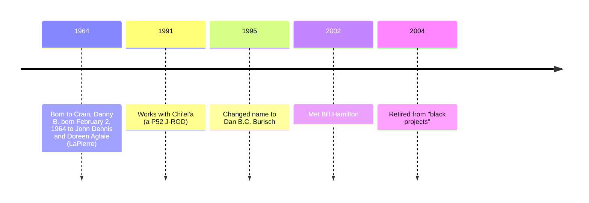

# Dan Burisch

Dr. Danny B. Burisch, formerly Dan B. Crain. Born 1964-02-02. Purported whistleblower from Area 51 and claims to be a member of Majestic-12.

# Media

- William F. Hamliton III
    * [Dr. Dan Burisch Biographical Info](https://web.archive.org/web/20021102115616/http://www.skywatch-research.org/BurischBio.htm)
    * [The Last Letter from Dr. Dan B.C. Burisch](https://web.archive.org/web/20021102115745/http://www.skywatch-research.org/message.htm)
- Linda Moulton Howe, *Earthfiles*
    * [The Chapter 7 Bankruptcy of Dan and Deborah Burisch](https://www.earthfiles.com/2004/07/13/the-chapter-7-bankruptcy-of-dan-and-deborah-burisch/), 2004
    * [Field Trip with Microbiologist Dan Burisch to Frenchman Mountain, Nevada](https://www.earthfiles.com/2004/06/12/part-1-field-trip-with-microbiologist-dan-burisch-to-frenchman-mountain-nevada/), June 2004
    * [Whistleblower Microbiologist Dan Burisch Interview](https://www.earthfiles.com/2004/05/19/part-1-whistleblower-microbiologist-dan-burisch-interview-on-june-7-2003/), June 2003
- Open Minds Radio [Michael Schratt discusses Dan Burisch](https://www.youtube.com/watch?v=x_koB91A6O0)
- Jeremy Rys (Alien Scientist) [Dan Burisch (Dan Crain)](https://alienscientist.com/burisch.html)
- Book: C. Ronald Garner *Alien Disclosure at Area 51*
- Project Camelot [Dan Burisch Summary](https://projectcamelotportal.com/2008/01/04/dan-burisch-summary/)

# Stolen valour claims

According to [Jeremy Rys](https://alienscientist.com/burisch.html):

> Vietnam Veteran and actual former Area 51 Employee Edgar Fouche worked with a few ex Navy Seals to file "Stolen Valor" charges against Dan "Burisch" Crain, subsequently prompting Dan to remove nearly 80% of his videos and other online materials from the web to avoid being charged and court martialed. 

# Eagles Disobey

*Eagles disobey: The case for Inca City, Mars* ISBN-13: 9780964809024

# Website

- [Eagles Disobey](https://web.archive.org/web/20040607235819/http://scorpius.spaceports.com/~bemused/eaglesdisobey/index.html) (2004 Internet Archive)

# Timeline

