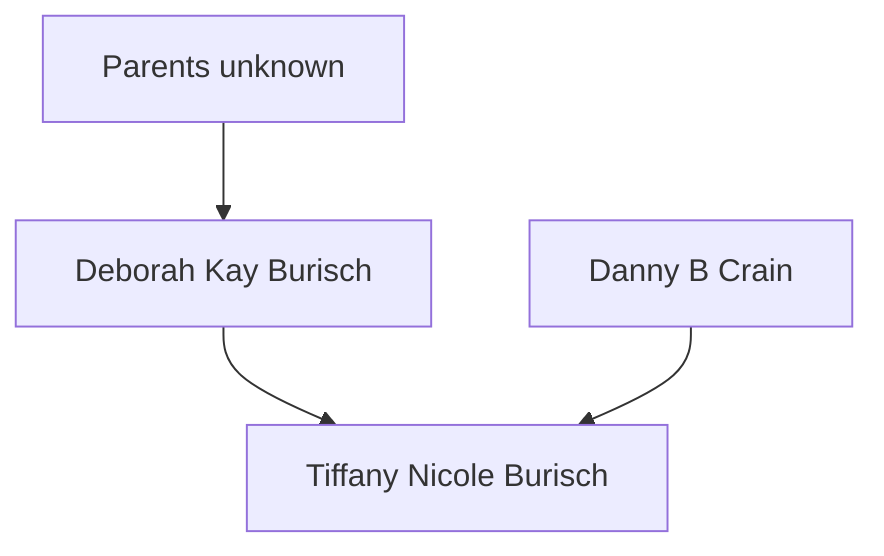

# Deborah Burisch

Deborah "Debbie" Kay Burisch. Borns 196?.

[Documents](./burisch_deborah/) including her white pages.

Deborah was [married](burisch_deborah/burisch_marriage_certificate_1990.jpg) to [Dan Burisch](burisch_dan.md) (then named Crain) in Las Vegas, Nevada, USA on 1990-07-17. In addition to the marriage certificate, this is confirmed in the Nevada Marriage Index for 1956&ndash;2005.

What happened to her since? Has she ever gone on the record?

She has lived in: 
- Greensboro, North Carolina
- Ocean Springs, Mississippi
- Las Vegas, Nevada
- Green Valley North, Henderson, Nevada

# Family

Descendent of [James Forrestal](forrestal_james.md), United States Secretary of Defense and purported [Majestic 12](../organisations/mj12.md) founding member.

Ancestry.com [All Web: Obituary Daily Times Index, 1995-2016 results for burisch](https://www.ancestry.co.uk/search/collections/70050/?name=_burisch&name_x=_s)

Who is Horst Kurt Burisch (1930-07-28 to 2003-02-06)? [U.S., Veterans' Gravesites, ca.1775-2019](https://www.findagrave.com/memorial/36464281/horst-k-burisch). He was in the military and lived in Scottsdale, Arizona, USA and is buried at National Memorial Cemetery of Arizona. He was a Corporal in the United States Marine Corps.

## Family tree

# MJ-12 member

Was she involved in covering up Dan's records?

[Garner 2008] implies his marriage was arranged while he worked at a parole officer in Las Vegas.

> He met the unlikely woman whom he would marry. There is
some reason to believe that she was a "plant" so that the powers that be might
better keep an eye on his private life

# Cover job

According to [Linda Moulton Howe](https://www.earthfiles.com/2004/07/13/the-chapter-7-bankruptcy-of-dan-and-deborah-burisch/)'s investigation:

> Bill Hamilton also understood that Deborah Burisch worked for the U. S. government as Dan’s government “handler,” a person assigned to monitor Burisch’s microbiology work, while maintaining her “cover job” as PBX Operator at the Mirage casino.

Casino worker 1990&ndash;2004. [Howe](https://www.earthfiles.com/2004/07/13/the-chapter-7-bankruptcy-of-dan-and-deborah-burisch/)

>  Deborah Burisch is listed as “PBX Operator” at the Mirage casino for 12 years in July 2002, or fourteen years by July 2004.

> Dan had told Bill Hamilton that his wife, Deborah, also worked with him in his classified government project, but she had a “cover job” in a Las Vegas casino.
> How could these two people be filing Chapter 7 bankruptcy on July 16, 2002, and simultaneously be working for a classified U. S. government project?

# Sources

- Linda Moulton Howe, ["The Chapter 7 Bankruptcy of Dan and Deborah Burisch"](https://www.earthfiles.com/2004/07/13/the-chapter-7-bankruptcy-of-dan-and-deborah-burisch/), 2004-07-13
