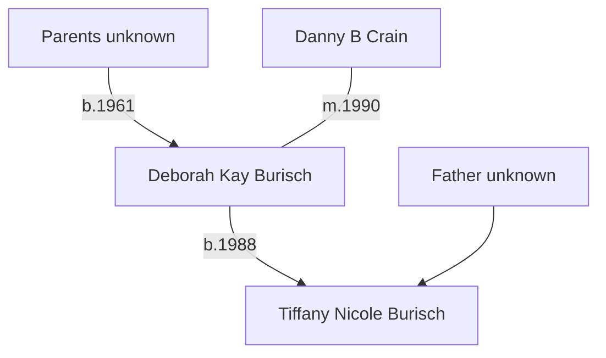

# Deborah Burisch

Deborah "Debbie" Kay Burisch. Born <time datetime="1961-06-30">30th June 1961</time>.
[Documents](./burisch_deborah/) including her white pages.

Deborah was [married](burisch_deborah/burisch_marriage_certificate_1990.jpg) to [Dan Burisch](burisch_dan.md) (then named Crain) in Las Vegas, Nevada, USA on 1990-07-17. In addition to the marriage certificate, this is confirmed in the Nevada Marriage Index for 1956&ndash;2005.

What happened to her since? Has she ever gone on the record?

She has lived in:
- Las Vegas High School, Las Vegas, Nevada (1977&ndash;1980)
- Greensboro, North Carolina
- Ocean Springs, Mississippi
- Las Vegas, Nevada (multiple addresses 1994&ndash;2008, 2011&ndash;2016, 2004&ndash;2016)
- Green Valley North, Henderson, Nevada (2014&ndash;2020)

# Family

Descendent of [James Forrestal](forrestal_james.md), United States Secretary of Defense and purported [Majestic 12](../organisations/mj12.md) founding member.

## Family tree

# MJ-12 member

Was she involved in covering up Dan's records?

[Garner 2008] implies his marriage was arranged while he worked at a parole officer in Las Vegas.

> He met the unlikely woman whom he would marry. There is
some reason to believe that she was a "plant" so that the powers that be might
better keep an eye on his private life

# Cover job

According to [Linda Moulton Howe](https://www.earthfiles.com/2004/07/13/the-chapter-7-bankruptcy-of-dan-and-deborah-burisch/)'s investigation:

> Bill Hamilton also understood that Deborah Burisch worked for the U. S. government as Dan’s government “handler,” a person assigned to monitor Burisch’s microbiology work, while maintaining her “cover job” as PBX Operator at the Mirage casino.

Casino worker 1990&ndash;2004. [Howe](https://www.earthfiles.com/2004/07/13/the-chapter-7-bankruptcy-of-dan-and-deborah-burisch/)

>  Deborah Burisch is listed as “PBX Operator” at the Mirage casino for 12 years in July 2002, or fourteen years by July 2004.

> Dan had told Bill Hamilton that his wife, Deborah, also worked with him in his classified government project, but she had a “cover job” in a Las Vegas casino.
> How could these two people be filing Chapter 7 bankruptcy on July 16, 2002, and simultaneously be working for a classified U. S. government project?

# Sources

- Linda Moulton Howe, ["The Chapter 7 Bankruptcy of Dan and Deborah Burisch"](https://www.earthfiles.com/2004/07/13/the-chapter-7-bankruptcy-of-dan-and-deborah-burisch/), 2004-07-13

## Geneology

- Deborah Kay Burisch in the U.S., Index to Public Records, 1994-2019
  * Voter Registration Lists, Public Record Filings, Historical Residential Records, and Other Household Database Listings. 
- Deborah Burisch, "U.S., School Yearbooks, 1880-2012"; School Name: Las Vegas High School; Year: 1977
- Nevada State Health Division, Office of Vital Records. Nevada Marriage Index, 1966-2005. Carson City, Nevada: Nevada State Health Division, Office of Vital Records. Book 724, Page C217874, Instrument number 95016
- Clark County, Nevada Marriage Bureau. Clark County, Nevada Marriage Index, 1956-1966. Las Vegas, Nevada: Clark County, Nevada Marriage Bureau.
- There are many [yearbook photos](./deborah_burisch/) of Deborah Burisch available online.
