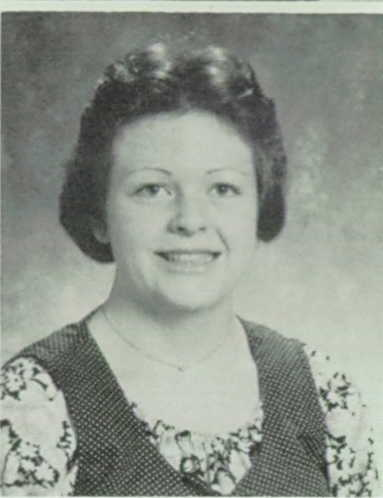
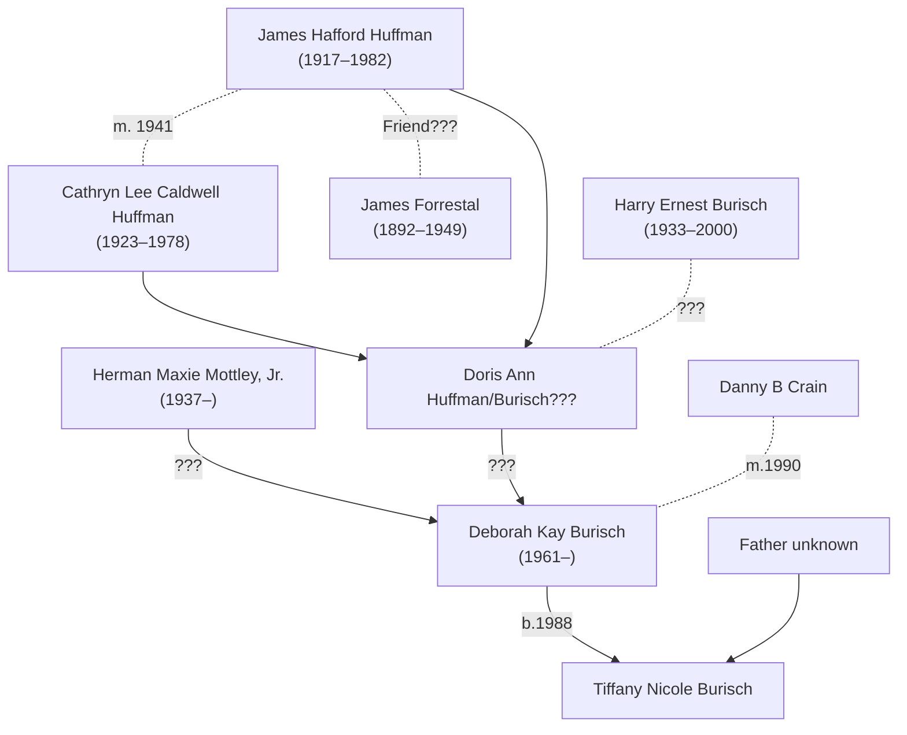

# Deborah Burisch

Deborah "Debbie" Kay Burisch was born <time datetime="1961-06-30">30th June 1961</time> [[source]](https://www.ancestry.co.uk/discoveryui-content/view/162769031:1732).

Deborah was [married](burisch_deborah/burisch_marriage_certificate_1990.jpg) to [Dan Burisch](burisch_dan.md) (then named Crain) in Las Vegas, Nevada, USA on 1990-07-17. In addition to the marriage certificate, this is confirmed in the Nevada Marriage Index for 1956&ndash;2005.

What happened to her since? Has she ever gone on the record?

She has lived in:
- Las Vegas High School, Las Vegas, Nevada (1977&ndash;1980)
- Greensboro, North Carolina
- Ocean Springs, Mississippi
- Las Vegas, Nevada (multiple addresses 1994&ndash;2008, 2011&ndash;2016, 2004&ndash;2016)
- Green Valley North, Henderson, Nevada (2014&ndash;2020)

# Forrestal connection

[Marica McDowell](mcdowell_marcia.md) claims that Deborah has "family ties" with [James Forrestal](forrestal_james.md), United States Secretary of Defense and purported [Majestic 12](../organisations/mj12.md) founding member. She stated [Hamilton page 224] in her [email of 10th August 2004](mcdowell_marcia/2004_ufo_magazine_email.txt) that [Deborah Burisch]() "a highly placed member of Majestic with family ties running all the way back to Forrestal."

> His association with Majestic is real. His work is real. His estrangement from his parents is real, even though it has nothing to do with his work in BlackOps. His bankruptcy is real. His work at S-4 is real. His writing about extraterrestrial biology is real. His amazing skill as a microbiologist, starting when he was 8 years old, under the mentorship of the chief pathologist at Long Beach Memorial, is real. His B.A in Psychology is real. His school ring, proclaiming his degree in biology (that kind of ring is not authorized until after the degree is completed) is real. His *marriage to a highly placed member of Majestic* with *family ties running all the way back to Forrestal*, is real. His injuries after being beating by somebody trying to stop him working on the Lotus project was all to painfully real. His inability to handle money is real. His Ph.D degree from SUNY is real, and it was REALLY erased, because I have it on affidavit from a man who personally got confirmation of his degree back in 1996! The degree was received by Dan's parents and framed - REAL! They swore to that on affidavit. The Ph.D degree was REALLY taken away by his wife (supposedly for safe keeping due to stresses in the parental home). She tells how she did it in her own words in an audio letter. REAL! All Dan ever had after that, was a photocopy of his Ph.D on the wall, but even that disappeared before he was shipped to Mississippi.

So far, the best guess I have is this:

- Deborah's maternal grandfather [James H. Huffman](huffman_james.md) was a friend of Forrestal. [source?]
  - Huffman would have been in his 20s when Forrestal was in power.

- When her mother remarried in 1982, Deborah's father-in-law [Harry Burisch](burisch_harry.md) was a US Navy veteran and allegedly worked as a courier for Majestic 12. [source?]
  - The problem with this is that I can't find a record of Doris having the surname Burisch before 1982.
  - Did Harry have enough time to befriend James Huffman before he died in 1982?

- Deborah became a member of Majestic 12 as a result of these family connections. [source?]

# Taped statements

Marcia McDowell claims [Hamilton page 237] in her [email of 10th August 2004](mcdowell_marcia/2004_ufo_magazine_email.txt) that Deborah recorded several statements:

> Plus, there are *taped statements from Deborah Burisch*. The most revealing of which expressly tells how she removed his original Ph.D degree certificate from his wall. Anyone can listen to her tell what happened in her own words by going to the archives at the end of this letter. It's all on file. She also talks about the bankruptcy, with great arrogance, I might add.

There were uploaded to the internet in c. 2004 but haven't yet been found (they may not have been archived.)

# Genealogy

Debbie is the step-daughter daughter of [Harry Burisch](burisch_harry.md), who's obituary describes "his wife, *Doris Ann*; one daughter, Deborah Kay Burisch."  Her mother seems to be [Doris Ann Huffman](huffman_doris.md), although this is not clear. She may or may not have a pseudonym as [Deborah Kay Mottley](mottley_deborah.md).

Was Harry Burisch involved in Majestic 12?

Was James Huffman involved in Majestic 12?

## Family tree

This is the current best attempt at reconstructing the genealogy of Debbie Burisch.

# MJ-12 member

Was she involved in covering up Dan's records?

[Garner 2008] implies his marriage was arranged while he worked at a parole officer in Las Vegas.

> He met the unlikely woman whom he would marry. There is
some reason to believe that she was a "plant" so that the powers that be might
better keep an eye on his private life

George Knapp writes [Knapp 2005]:

> Who believes this stuff? His wife Deborah for one. She signed a sworn statement saying she too works for MJ-12, the secret government.
>
> ...
>
> There are photos of Burisch and his wife in military garb saluting each other. 

# Cover job

According to [Linda Moulton Howe](https://www.earthfiles.com/2004/07/13/the-chapter-7-bankruptcy-of-dan-and-deborah-burisch/)'s investigation:

> Bill Hamilton also understood that Deborah Burisch worked for the U. S. government as Dan’s government “handler,” a person assigned to monitor Burisch’s microbiology work, while maintaining her “cover job” as PBX Operator at the Mirage casino.

Knapp writes [Knapp 2005]:

> He met his wife as a parole officer. She was there on drug charges. She's spent 12 years in the PBX department of the Mirage, but that's just a cover job. 

Casino worker 1990&ndash;2004. [Howe](https://www.earthfiles.com/2004/07/13/the-chapter-7-bankruptcy-of-dan-and-deborah-burisch/)

>  Deborah Burisch is listed as “PBX Operator” at the Mirage casino for 12 years in July 2002, or fourteen years by July 2004.

> Dan had told Bill Hamilton that his wife, Deborah, also worked with him in his classified government project, but she had a “cover job” in a Las Vegas casino.
> How could these two people be filing Chapter 7 bankruptcy on July 16, 2002, and simultaneously be working for a classified U. S. government project?

# References

- Linda Moulton Howe, ["The Chapter 7 Bankruptcy of Dan and Deborah Burisch"](https://www.earthfiles.com/2004/07/13/the-chapter-7-bankruptcy-of-dan-and-deborah-burisch/), 2004-07-13

## Genealogy

- [Deborah Kay Burisch in the U.S., Index to Public Records, 1994-2019](https://www.ancestry.co.uk/discoveryui-content/view/334934689:1788). Voter Registration Lists, Public Record Filings, Historical Residential Records, and Other Household Database Listings.
- [Deborah Burisch in the U.S., Public Records Index, 1950-1993, Volume 2](https://www.ancestry.co.uk/discoveryui-content/view/162769031:1732). Voter Registration Lists, Public Record Filings, Historical Residential Records, and Other Household Database Listings.
- Deborah Burisch, "U.S., School Yearbooks, 1880-2012"; School Name: Las Vegas High School; Year: 1977
- [Marriage certificate](burisch_deborah/burisch_marriage_certificate_1990.jpg) Nevada State Health Division, Office of Vital Records. Nevada Marriage Index, 1966-2005. Carson City, Nevada: Nevada State Health Division, Office of Vital Records. [Book 724, Page C217874, Instrument number 95016](https://www.ancestry.com/discoveryui-content/view/7406902:1100)
- [Deborah Kay Burisch in the Nevada, U.S., Marriage Index, 1956-2005](https://www.ancestry.co.uk/discoveryui-content/view/7406902:1100). Clark County, Nevada Marriage Bureau. Clark County, Nevada Marriage Index, 1956-1966.
- There are many [yearbook photos](./deborah_burisch/) of Deborah Burisch available online.
- [Dr Dan Burisch Information](https://godlike.com/forum1/message157012/pg1?regp=bm9fMTcwMTU0NzgxNw==) forum thread on Godlike Production by "Boomerang".
- George Knapp, [Dr. Crain's UFO Claims Raise Questions](https://web.archive.org/web/20060316221612/http://www.klas-tv.com/Global/story.asp?S=4190378), *KLAS TV*, 5th December 2005.
