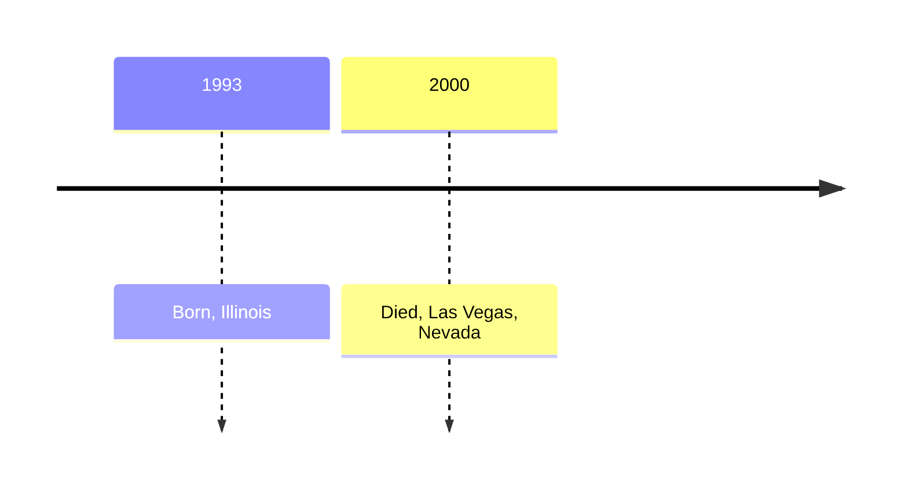

# Harry Burisch

Harry Ernest Burisch (11th April 1933&ndash;6th August 2000).

US Navy. Dates?

Link to [James Forrestal](forrestal_james.md)?

# Timeline



## Employment

[U.S., City Directories, 1822-1995](https://www.ancestry.com/discoveryui-content/view/680455439:2469) Roanoke, Virginia, City Directory, 1958

> Burish Harry E (Nadean) driver Armored Motor Serv
>
> Mrs Nadean G Burisch clk GMAC

## Marriage

Nadean Guthrie

* [Marriage record](https://www.ancestry.com/discoveryui-content/view/11333211:9279) 12th November 1955, Virginia
* [Divorce record](https://www.ancestry.com/discoveryui-content/view/3599171:9280) 1973 Virginia

## Death

[Obituary](https://www.ancestry.co.uk/discoveryui-content/view/10243315:70050) records:

- *Las Vegas Sun*, 2000-08-10
- *Las Vegas Review Journal*, 2000-08-10

```
BURISCH, Harry Ernest; 67; Aurora IL>Las Vegas NV; Las Vegas R-J; 2000-8-10; rossy
BURISCH, Harry Ernest; 67; Aurora IL>Las Vegas NV; Las Vegas Sun; 2000-8-10; neb
```

# Genealogy

Not confirmed family link to [Deborah Burisch](burisch_deborah.md).