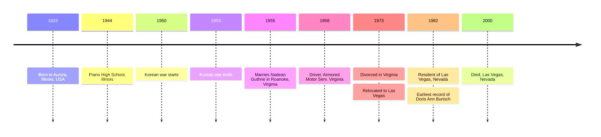
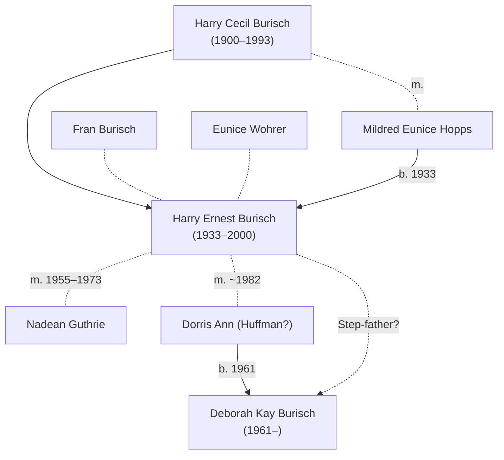

# Harry Burisch

Harry Ernest Burisch (11th April 1933&ndash;6th August 2000) seems to have been the father of [Deborah Burisch](burisch_deborah.md), who is [Dan Burisch's](burisch_dan.md) first wife and suspected [Majestic Twelve](../organisations/mj12.md) member.

[Marcia McDowell](mcdowell_marcia.md) stated [Hamilton page 226] in her [email of 10th August 2004](mcdowell_marcia/2004_ufo_magazine_email.txt) that Harry is the name of Deborah's father.

>Deborah Burisch, *Harry (her father)*, Doreen Crain (Dan´s mother) and John Crain (Dan´s father) were in the audience that day. Everybody stiffened up visibly. The big guys who had their hands crossed over their suit jackets and kept staring at Dan (security personnel) were poised on a knife-edge in case Dan said the wrong thing.

"Family ties" to [James Forrestal](forrestal_james.md)? What does this mean? Did he marry the daughter of [James Huffman](huffman_james.md) in Las Vegas in c. 1982? It's coincidental that Harry married Nadean in Roanoke, Virginia, which is the same place that [Herman](mottley_herman.md) & [Doris Mottley](huffman_doris.md) lived.

# Timeline



## Military service

His obituary says he was a Navy veteran in the Korean War (1950&ndash;1953). I can't find any record of this. There are records for Horst K Burisch and [Victor Alfred Burisch](https://aad.archives.gov/aad/record-detail.jsp?dt=893&mtch=1&cat=GP23&tf=F&q=burisch&bc=sl&rpp=10&pg=1&rid=2915257), but not Harry Ernest.

## Employment

[U.S., City Directories, 1822-1995](https://www.ancestry.com/discoveryui-content/view/680455439:2469) Roanoke, Virginia, City Directory, 1958

> Burish Harry E (Nadean) driver Armored Motor Serv
>
> Mrs Nadean G Burisch clk GMAC

## Marriage

### Nadean Guthrie (1955&ndash;1973)

* [Marriage record](https://www.ancestry.com/discoveryui-content/view/11333211:9279) 12th November 1955, Virginia
* [Divorce record](https://www.ancestry.com/discoveryui-content/view/3599171:9280) 1973 Virginia

Second marriage to Dorris Ann?

## Death

Harry died at age 67 on 6th August 2000 in ZIP 89102, Las Vegas, Clark, Nevada, USA.

This is [Harry's obituary](https://lasvegassun.com/news/2000/aug/10/obituaries-for-august-10-2000/) in the Las Vegas Sun from 10th August 2000.

> Harry Ernest Burisch, 67, of Las Vegas died Sunday in a local hospital. He was born April 11, 1933, in Aurora, Ill. A resident for 27 years, he was a retired air-conditioning service representative and a Korean War Navy veteran.
>
> He is survived by **his wife, Doris Ann**; one daughter, **Deborah Kay Burisch** of Las Vegas; two sisters, Eunice Wohrer of San Diego and Fran Burisch of Florida; and two grandchildren.

Harry has another [obituary](https://www.ancestry.co.uk/discoveryui-content/view/10243315:70050) in *Las Vegas Review-Journal*, 2000-08-10.

```
BURISCH, Harry Ernest; 67; Aurora IL>Las Vegas NV; Las Vegas R-J; 2000-8-10; rossy
BURISCH, Harry Ernest; 67; Aurora IL>Las Vegas NV; Las Vegas Sun; 2000-8-10; neb
```

# Genealogy

Harry may be [Deborah Burisch](burisch_deborah.md)'s step-father. Did he marry [Doris Ann Huffman](huffman_doris.md) in c. 1982?



# References

* Harry Ernest Burisch in the U.S., Social Security Applications and Claims Index, 1936-2007.
* Harry Ernest Burisch in the Virginia, U.S., Marriage Records, 1936-2014. Certificate Number 1955031856. 
* Harry Burisch, in the U.S., School Yearbooks, 1900-2016. U.S., School Yearbooks, 1880-2012"; School Name: Plano High School; Year: 1944.
* Las Vegas Sun [Obituaries for August 10, 2000](https://lasvegassun.com/news/2000/aug/10/obituaries-for-august-10-2000/)
* US National Archives, Social Security Application (SS-5) Files, 1936 - 2007 [Harry Ernest Burisch](https://aad.archives.gov/aad/record-detail.jsp?dt=3059&mtch=17&cat=all&tf=F&q=burisch&bc=&rpp=10&pg=1&rid=2370491&rlst=4517287,1344816,1516524,2370491,2370492,4398410,4493646,4493647,4566915,8891639)
