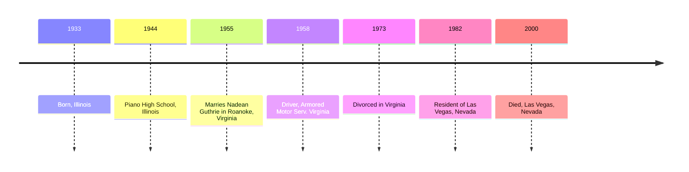
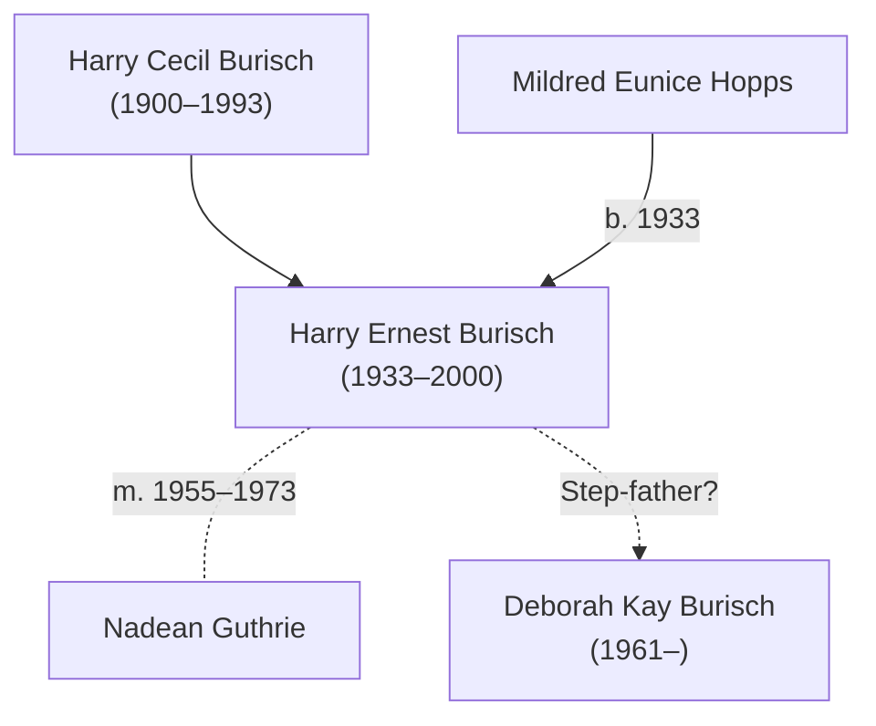

# Harry Burisch

Harry Ernest Burisch (11th April 1933&ndash;6th August 2000) was the father of [Deborah Burisch](burisch_deborah.md), [Dan Burisch's](burisch_dan.md) first wife.

Marcia McDowell stated [Hamilton page 226] in her [email of 10th August 2004](mcdowell_marcia/2004_ufo_magazine_email.txt) that Harry is the name of Deborah's father.

>Deborah Burisch, *Harry (her father)*, Doreen Crain (Dan´s mother) and John Crain (Dan´s father) were in the audience that day. Everybody stiffened up visibly. The big guys who had their hands crossed over their suit jackets and kept staring at Dan (security personnel) were poised on a knife-edge in case Dan said the wrong thing.

"Family ties" to [James Forrestal](forrestal_james.md)? What does this mean? Did he marry the daughter of [James Huffman](huffman_james.md) in Las Vegas in c. 1982? It's coincidental that Harry married Nadean in Roanoke, Virginia, which is the same place that [Herman](mottley_herman.md) & [Doris Mottley](huffman_doris.md) lived.

# Timeline

US Navy. Dates?



## Employment

[U.S., City Directories, 1822-1995](https://www.ancestry.com/discoveryui-content/view/680455439:2469) Roanoke, Virginia, City Directory, 1958

> Burish Harry E (Nadean) driver Armored Motor Serv
>
> Mrs Nadean G Burisch clk GMAC

## Marriage

Nadean Guthrie

* [Marriage record](https://www.ancestry.com/discoveryui-content/view/11333211:9279) 12th November 1955, Virginia
* [Divorce record](https://www.ancestry.com/discoveryui-content/view/3599171:9280) 1973 Virginia

## Death

Died 6th August 2000 in ZIP 89102, Las Vegas, Clark, Nevada, USA.

[Obituary](https://www.ancestry.co.uk/discoveryui-content/view/10243315:70050) records:

- *Las Vegas Sun*, 2000-08-10
- *Las Vegas Review Journal*, 2000-08-10

```
BURISCH, Harry Ernest; 67; Aurora IL>Las Vegas NV; Las Vegas R-J; 2000-8-10; rossy
BURISCH, Harry Ernest; 67; Aurora IL>Las Vegas NV; Las Vegas Sun; 2000-8-10; neb
```

# Genealogy

Harry may be [Deborah Burisch](burisch_deborah.md)'s step-father. Did he marry [Doris Ann Huffman](huffman_doris.md) in c. 1982?



# References

* Harry Ernest Burisch in the U.S., Social Security Applications and Claims Index, 1936-2007.
* Harry Ernest Burisch in the Virginia, U.S., Marriage Records, 1936-2014. Certificate Number 1955031856. 
* Harry Burisch, in the U.S., School Yearbooks, 1900-2016. U.S., School Yearbooks, 1880-2012"; School Name: Plano High School; Year: 1944.
