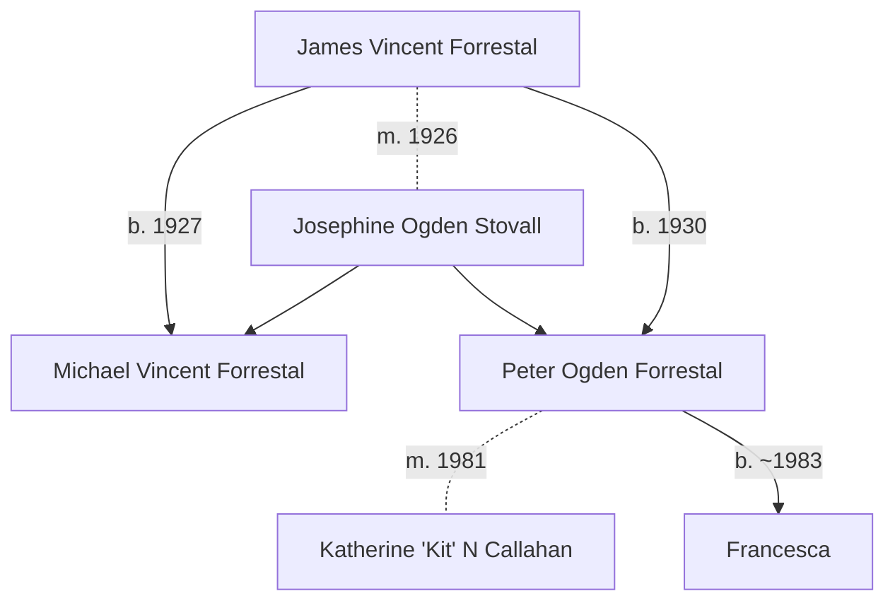

# James Forrestal

James Vincent Forrestal (1892&ndash;1949) was the  United States Secretary of Defense.

# Majestic Twelve

Purported member of [MJ-12](../organisations/mj12.md).

# Family

## Family tree

# Death

Forrestal reportedly committed suicide at Patient at Bethesda Naval Hospital. This is a suspected assassination.

- Richard Dolan [The Death of James Forrestal](https://www.youtube.com/watch?v=mDKPtUc4MJQ)
- Aerial Phenomena with Richard Dolan, [*The Suspicious Death of James Forrestal*](https://www.gaia.com/video/the-suspicious-death-of-james-forrestal)
- David Martin *The Assassination of James Forrestal*, 2021

# Sources

## Genealogy

Peter Ogden Forrestal

- New Jersey, U.S., Marriage Index, 1901-2016, Certificate Number 48428, Oct 1981.
- Note [Death, Posted 28 Aug 2014 by VickyNewman69](https://www.ancestry.com/mediaui-viewer/collection/1030/tree/62126081/person/32264616114/media/042cf328-15ff-4e17-b636-52efdc2a09e3)
  * "His last job was with Bankers Trust in London, and he had a home in Ireland where he kept his horses. He died alone there in 1983 of a massive abdominal hemorrhage caused by years of heavy drinking. He was 52."
- [Grave 28 May 1982, Ireland](https://www.ancestry.com/discoveryui-content/view/59317381:60525)
- Daughter:
  * [Francesca Cassell Forrestal?](https://www.ancestry.com/discoveryui-content/view/302157380:62209) 2011-2020 Miami, Florida, USA
- Wife, married in New Jersey just before his death in October 1981:
  * Katherine 'Kit' N Callahan is from New Jersey.
