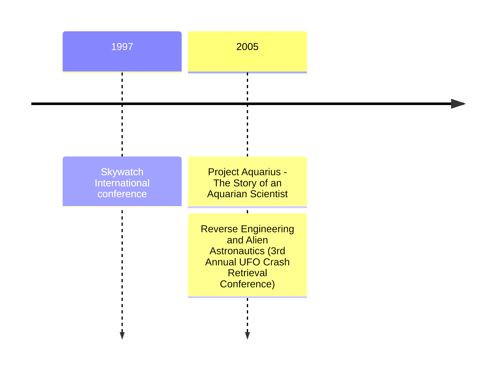

# William F. Hamilton III

# About

William "Bill" F. Hamilton III (?&ndash;2014) is an IT worker and veteran UFO researcher who investigated the [Burisch](burisch_dan.md) case. Long-time MUFON member and associate of Michael Salla's Expolitics Institute. [Exopedia biography](https://www.exopaedia.org/Hamilton%2C+William)

# Skywatch International

A UFO research organisation.

# Media

- Video: [Bill Hamilton Skywatch International UFO Conference](https://www.youtube.com/watch?v=fmq1HIh4J9o) on the Phoenix Lights, 1997-11-15
- Book: *Project Aquarius: The Story of an Aquarian Scientist*, 2005, ISBN 13 978-1420876567
- Video: Linda Moulton-Howe *Earthfiles*  2022-05-25 [What was 1949 Project Aquarius's mission with 'Alien creatures'?](https://www.youtube.com/watch?v=71yUu40NsrU)
- Video: [Bill Hamilton, Project Aquarius, and the Dan Burisch Story](https://www.youtube.com/watch?v=q6N1z6PshHQ), MUFON conference 2005-09-15
- Correspondence: Bill Hamilton [Mystery Of Dr. Dan Burisch - Beginning To End](https://rense.com/general42/mssy.htm)
- Article: *Reverse Engineering and Alien Astronautics*, [3rd Annual UFO Crash Retrieval Conference Proceedings](https://archive.org/details/crash-retrieval-conference-proceedings-3rd-annual-2005/mode/1up), 2005
- Page: Skywatch International [UFO page](https://web.archive.org/web/20021011031159/http://skywatch-research.org/ufo.html) (defunct since 2004)
- Video: [Bill Hamilton - UFOs and Government investigations](https://www.youtube.com/watch?v=KNF61xAuzO8) c.1999
- NOUFORS [Bill Hamilton profile](http://noufors.com/Bill_Hamilton.htm)
- [AstroSciences research network](https://web.archive.org/web/20051031195254/https://www.astrosciences.info/) c.2005

# Timeline

