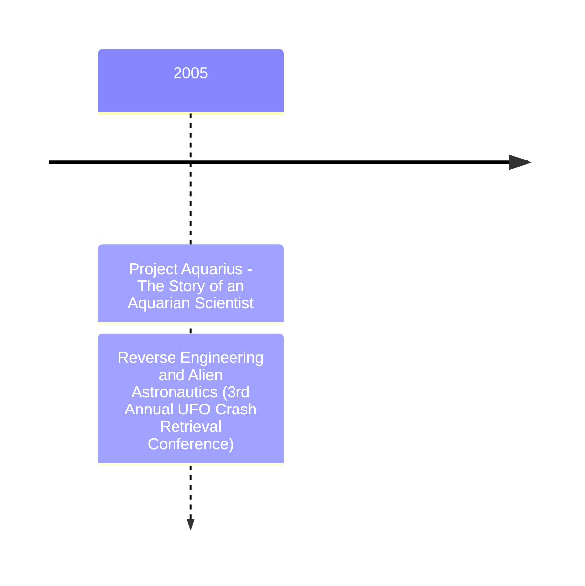

# William F. Hamilton III

William "Bill" F. Hamilton III is a UFO researcher. Senior programmer and analyst at UCLA, 30 years in the Information Technology sector.

# Media

- Book: *Project Aquarius: The Story of an Aquarian Scientist*, 2005, ISBN 13 978-1420876567
- Video: Linda Moulton-Howe *Earthfiles*  2022-05-25 [What was 1949 Project Aquarius's mission with 'Alien creatures'?](https://www.youtube.com/watch?v=71yUu40NsrU)
- Video: [Bill Hamilton, Project Aquarius, and the Dan Burisch Story](https://www.youtube.com/watch?v=q6N1z6PshHQ), MUFON conference 2005-09-15
- Correspondence: Bill Hamilton [Mystery Of Dr. Dan Burisch - Beginning To End](https://rense.com/general42/mssy.htm)
- Article: *Reverse Engineering and Alien Astronautics*, [3rd Annual UFO Crash Retrieval Conference Proceedings](https://archive.org/details/crash-retrieval-conference-proceedings-3rd-annual-2005/mode/1up), 2005

# Timeline

