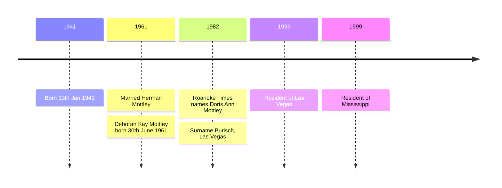

# Doris Huffman

Doris Ann Huffman AKA Burisch AKA Mottley (née Huffman) was born on 13th January 1941 in Roanoke, Virginia, USA.

She was the daughter of James Hafford Huffman, who may have been a courier for Majestic 12. Was James Huffman and friend of Secretary James Forrestal?

She married Herman Maxie Mottley in 1961.

She had a daughter named [Deborah Kay Mottley](mottley_deborah.md) who was born on 30th June 1961.

There is a [record](https://www.ancestry.co.uk/discoveryui-content/view/93994757:1788) of Doris A. Burisch in 1982 who was also born in January 1941. Is this the same woman, who married Harry Ernest Burisch in Las Vegas?

Obituary in the *The Roanoke Times* from [9th March 1982](https://www.newspapers.com/newspage/918253258/) published in Roanoke, Virginia.

```
will follow in Maple Grove Ceme tery riends may call at Lynch uneral Home after 2:00 pm ri day HUMAN JAMES NEW CASTLE James Haf ford Huffman age 64 died at home Tuesday He was a retired employee of Associated Transport He is sur vived by one daughter Mrs Doris Ann Mottley one granddaughter Deborah Kay Mottley one brother Harless Huffman New Castle two sisters Mrs Josephine Dame wood New Castle Mrs lorence posed as a flood control measure for the Roa noke Valley Kit Kiser director of utilities and operations said Wednesday that 
```

# Timeline




# References

- Doris Ann Huffman in the Virginia, U.S., Birth Records, 1912-2015, Delayed Birth Records, 1721-1920. Certificate Number 1941001052. Virginia, Births, 1721–2015. Virginia Department of Health, Richmond, Virginia.
- Doris A Burisch in the U.S., Public Records Index, 1950-1993, Volume 1. Voter Registration Lists, Public Record Filings, Historical Residential Records, and Other Household Database Listings.
