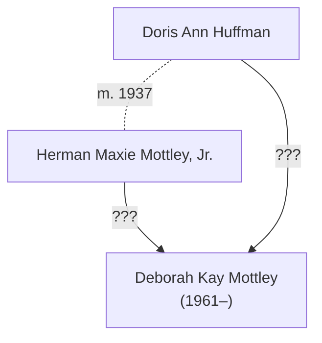

# Deborah Kay Mottley

Deborah Kay Mottley was [born 30th June 1961](https://www.ancestry.com/discoveryui-content/view/3286172:9277) in Roanoke, Virginia, USA.

# Alias for Deborah Burisch

Is this the same person as [Debbie Burisch](burisch_deborah.md)?

Coincidences:

* Same birth date
* Same first and middle name
* Same mother, [Doris Ann Huffman](huffman_doris.md)

Differences:

* Contradictory yearbook photos (straight versus curly hair, etc.) This might be a different person, "Debbie Mottley" and not "Deborah Kay Mottley"?
  * DKM Appomattox High School, Virginia. (1975&ndash;1977)
  * DKB Las Vegas High School, Las Vegas, Nevada. (1977&ndash;1980)

# Genealogy

# References

- Birth record [Deborah Kay Mottley](https://www.ancestry.com/discoveryui-content/view/3286172:9277) in the Virginia, U.S., Birth Records, 1912-2015, Delayed Birth Records, 1721-1920. Certificate Number 1961047691. Virginia Department of  Health; Richmond, Virginia; Virginia, Births, 1864-2015.
- U.S., School Yearbooks, 1900-2016 for Debbie Mottley, Appomattox High School, Virginia. 1977