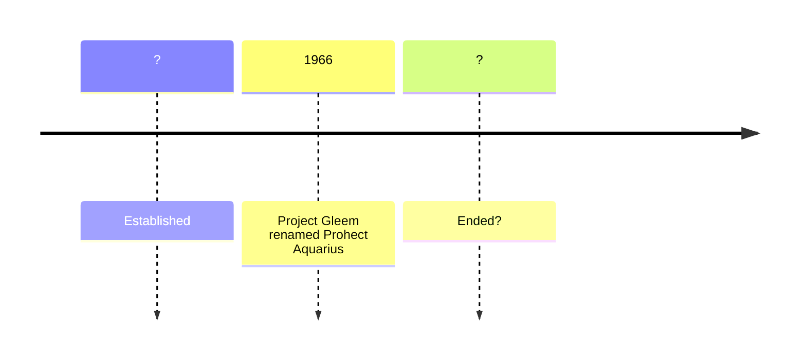

# Project Aquarius

Operated by [Majestic 12](../organisations/mj12.md).

Formerly Project GLEEM.

Project Aquarius was an umbrella term for various secret projects involving research into UFOnauts at Area 51.

Burisch [claims](https://web.archive.org/web/20210925062617/https://paolaharris.com/home-page/interview-with-micro-biologist-dr-dan-burisch) that the project was named after the home of the P-52 J-RODs.

> Aquarius Constellation: Gleise 876C. That is the origin of the name for Project Aquarius.

[Anon2023PDF](https://archive.org/details/anon_pdf_from_markdown)
> Project Aquarius investigating an extraterrestrial entity "J-Rod" and its neuropathy

# Timeline



# Links

- William Hamilton [Project Aquarius and the Story of Dr. Dan Burisch](https://web.archive.org/web/20061006012118/https://www.astrosciences.info/Aquarius.htm), October 2005

# Leaked 1970s Aquarius document

- Unknown source, [Executive Correspondence](https://archive.org/details/project-aquarius-11-pages/page/n5/mode/2up) sent to Linda Moulthon Howe.
- Linda Moulton Howe 2023-06-06 [Project Aquarius – TOP SECRET MJ12 ORCON – Funded by CIA to Study UFO/IAC Sightings and Contacts with Alien Life Forms](https://www.earthfiles.com/2022/06/06/project-aquarius-top-secret-mj12-orcon-funded-by-cia-to-study-ufo-iac-sightings-and-contacts-with-alien-life-forms/)

# AFOSI memo

Timothy Good *Above Top Secret* page 260
> My inquiries into the authenticity of the Majestic 12 story during a research trip to the United States in 1986 have led me to
> believe that the group did indeed exist, and the document seems authentic enough. Unfortunately, all the members are now deceased, and my
> questions addressed to a former Director of the CIA, as well as two ex-Presidents,
> remain unanswered, which is hardly surprising. But it is interesting that
> "MJ-12" crops up in an alleged Air Force Office of Special Investigations (AFOSI) document, dated 17 November
> 1980. Paragraph 2 states:

```
...OFFICIAL US GOVERNMENT POLICY AND RESULTS OF PROJECT AQUARIUS IS STILL CLASSIFIED TOP SECRET WITH NO DISSEMINATION
OUTSIDE OFFICIAL INTELLIGENCE CHANNELS AND WITH RESTRICTED ACCESS TO 'MJ TWELVE.'
```

> AFOSI have informed me that the retyped document is a fabrication, yet the existence of Project Aquarius has now been confirmed
> by the National Security Agency. It is still classified Top Secret, and details therefore remain exempt from disclosure (see Chapter
> 17). There is as yet no official confirmation of the existence of MJ-12, however.

Timothy Good *Above Top Secret*, page 425

> In a leaked document purporting to originate with the US Air Force Office
> of Special Investigations (AFOSI) — its authenticity denied to me by both
> AFOSI and NASA — there is an intriguing reference to “Project Aquarius.”
> Another leaked memo mentions “Project Sigma,” allegedly initiated in
> 1954 to establish communication with aliens. “This Project met with
> positive success,” the spurious-looking document states, and goes on to
> describe how a USAF intelligence officer "met two aliens at a pre-
> arranged location in the desert of New Mexico
> ...this project is continuing at an Air Force base in New Mexico." The same document lists
> "Project Snowbird" (referred to in Chapter 12), allegedly established in
> 1972; its mission was to test fly a recovered alien aircraft. The project
> is said to be continuing in Nevada.
